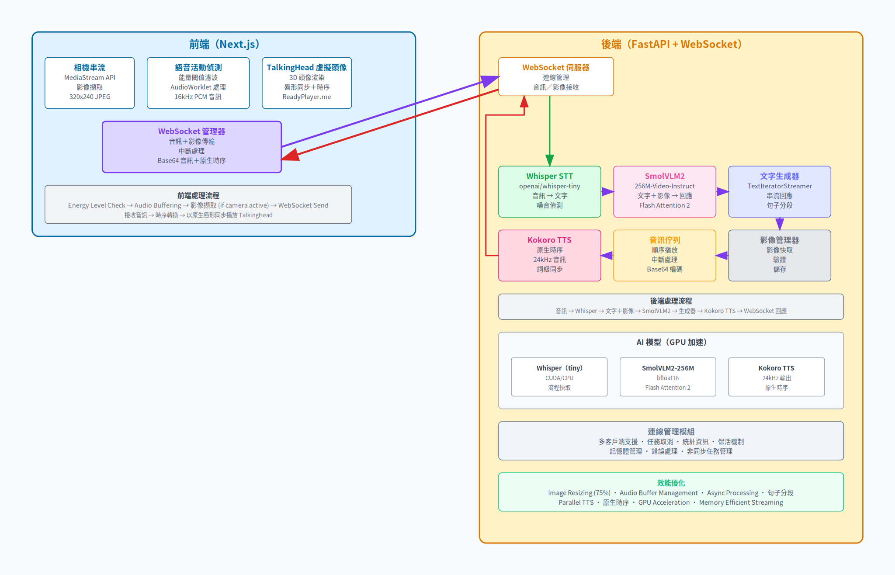

# 🎭 TalkMateAI 地端多模態 AI 伴侶

**基於地端（Local Host）運行的 3D 虛擬伴侶，提供 100% 隱私保護、零頻寬成本、毫秒級流暢對答與實時相機視覺辨識。**

> 本專案為實戰導向的地端 AI 教學手冊配套完整程式碼，特別針對 Windows 部署、CORS 網路障礙、Windows 語系編碼以及最新世代顯示卡硬體架構（如 NVIDIA RTX 5090 Blackwell）提供完備的「全線 CPU 穩定相容防禦模式」與「GPU 滿血加速版」。

## 🎭 TalkMateAI 雲端多模態 AI 伴侶

TalkMateAI 也可以部署成 Hugging Face Docker Space，讓手機、平板與不同網路環境的瀏覽器直接透過 HTTPS 使用，不需要自行架設 ngrok、反向代理或公網 IP。雲端版本會將 Next.js 前端靜態輸出與 FastAPI 後端整合在同一個 Docker 容器中，並由 Hugging Face Space 對外提供 `https://<space-name>.hf.space/` 網址。

雲端部署適合：

- 想用手機直接測試相機、麥克風與 WebSocket 互動。
- 想把 TalkMateAI 分享給其他裝置或朋友試用。
- 不想處理本機 HTTPS、CORS、公網穿透與防火牆設定。
- 希望用 Hugging Face 的 CPU/GPU Space 快速驗證 AI 伴侶原型。

目前建議部署方式：

- GitHub Repo: `https://github.com/wangsungwen/TalkMetaAI`
- Hugging Face Space: `https://huggingface.co/spaces/wangsongwen/TalkmetaAI`
- Space SDK: `Docker`
- App Port: `7860`
- 建議硬體: `CPU Basic` 可啟動完整服務；若要更好的推理速度，建議升級 GPU Space。

---

## ☁️ 從 GitHub 安裝至 Hugging Face Space

以下流程適合從零開始，把 GitHub Repo 部署到 Hugging Face Space 雲端。

### 1. 建立 Hugging Face Space

1. 前往 [Create a new Space](https://huggingface.co/new-space)。
2. Owner 選擇你的 Hugging Face 帳號，例如 `wangsongwen`。
3. Space name 填入 `TalkmetaAI`。
4. SDK 選擇 `Docker`。
5. Hardware 先選 `CPU Basic`；需要更快回應速度時再升級 GPU。
6. 建立 Space 後，確認 Space URL 類似：

```text
https://huggingface.co/spaces/wangsongwen/TalkmetaAI
```

### 2. 確認 README Space 設定

Hugging Face Space 會讀取 README 開頭的 YAML metadata。本專案根目錄 `README.md` 開頭應包含：

```yaml
---
title: TalkMetaAI
emoji: 🤖
colorFrom: blue
colorTo: purple
sdk: docker
app_port: 7860
pinned: false
license: mit
---
```

其中最重要的是：

```yaml
sdk: docker
app_port: 7860
```

### 3. 確認 Dockerfile 啟動設定

根目錄必須有 `Dockerfile`，且最後啟動 FastAPI 時必須監聽 `0.0.0.0` 與 Hugging Face 指定的 port：

```dockerfile
EXPOSE 7860

CMD sh -c "uvicorn main:app --host 0.0.0.0 --port ${PORT:-7860}"
```

### 4. 補齊 Kokoro 中文語音依賴

如果雲端 log 出現：

```text
ModuleNotFoundError: No module named 'ordered_set'
```

代表 Kokoro 中文管線缺少 `misaki.zh` 需要的中文分詞與拼音依賴。請確認 `Dockerfile` 的 `pip install` 區塊包含：

```dockerfile
        "cn2an" \
        "g2pM" \
        "jieba" \
        kokoro \
        numpy \
        "ordered-set" \
        packaging \
        pypinyin \
```

同時確認 `apps/server/pyproject.toml` 的 `dependencies` 包含：

```toml
    "kokoro",
    "jieba",
    "g2pM",
    "ordered-set",
    "pypinyin",
    "cn2an",
```

注意：PyPI 套件名稱是 `ordered-set`，但 Python import 名稱是 `ordered_set`。

更新 lockfile：

```powershell
cd apps/server
uv lock
cd ../..
```

可用以下指令做最小依賴驗證：

```powershell
uvx --python 3.10 --with ordered-set --with jieba --with g2pM --with pypinyin --with cn2an --with numpy python -c "import ordered_set, jieba, g2pM, pypinyin, cn2an; print('zh deps ok')"
```

成功時會看到：

```text
zh deps ok
```

### 5. Push 到 GitHub

在專案根目錄執行：

```powershell
git status --short
git add Dockerfile apps/server/pyproject.toml apps/server/uv.lock README.md
git commit -m "Document Hugging Face Space deployment"
git push origin main
```

若首次 commit 時 Git 要求設定身分：

```powershell
git config user.name "wangsungwen"
git config user.email "wangsungwen@users.noreply.github.com"
```

### 6. 將 GitHub Repo 同步到 Hugging Face Space

如果 Space 是從 GitHub 匯入並已啟用同步，push 到 GitHub 後 Hugging Face 會自動 rebuild。

如果 Hugging Face Space 是獨立 repo，請加上 HF remote：

```powershell
git remote add hf https://huggingface.co/spaces/wangsongwen/TalkmetaAI
git push hf main:main
```

若 Windows git 認證卡住，可改用 Hugging Face SDK 直接提交關鍵檔案：

```powershell
python -c "from pathlib import Path; from huggingface_hub import HfApi, CommitOperationAdd; root=Path.cwd(); repo_id='wangsongwen/TalkmetaAI'; paths=['Dockerfile','apps/server/pyproject.toml','apps/server/uv.lock','README.md']; ops=[CommitOperationAdd(path_in_repo=p, path_or_fileobj=str(root / p)) for p in paths]; print(HfApi().create_commit(repo_id=repo_id, repo_type='space', operations=ops, commit_message='Update Hugging Face deployment docs and dependencies'))"
```

### 7. 執行 Factory Rebuild

修改 Dockerfile 或 Python 依賴後，建議執行 Factory rebuild，避免 Hugging Face 沿用舊快取：

```powershell
python -c "from huggingface_hub import HfApi; print(HfApi().restart_space(repo_id='wangsongwen/TalkmetaAI', factory_reboot=True))"
```

Space 狀態通常會依序變成：

```text
RUNNING_BUILDING
RUNNING_APP_STARTING
RUNNING
```

### 8. 檢查部署狀態

查看 Space 狀態：

```powershell
hf spaces info wangsongwen/TalkmetaAI
```

查看 runtime log：

```powershell
hf spaces logs wangsongwen/TalkmetaAI --tail 200
```

查看 build log：

```powershell
hf spaces logs wangsongwen/TalkmetaAI --build --tail 120
```

Windows PowerShell 若遇到 CP950 編碼錯誤，可先切 UTF-8：

```powershell
chcp 65001
$env:PYTHONIOENCODING="utf-8"
```

### 9. 驗證雲端網址

開啟：

```text
https://wangsongwen-talkmetaai.hf.space/
```

或用 PowerShell 檢查 HTTP status：

```powershell
(Invoke-WebRequest -Uri "https://wangsongwen-talkmetaai.hf.space/" -UseBasicParsing -TimeoutSec 30).StatusCode
```

成功應回：

```text
200
```

Runtime log 應看到：

```text
Application startup complete.
Uvicorn running on http://0.0.0.0:7860
WebSocket /ws/test-client [accepted]
```

且不應再出現：

```text
ModuleNotFoundError: No module named 'ordered_set'
```

[](https://python.org)
[](https://fastapi.tiangolo.com)
[](https://nextjs.org)
[](LICENSE)

---

## 🎥 示範影片 (Demo Video)

[](https://www.youtube.com/watch?v=dE_8TXmp2Sk)

---

## ✨ 核心特色

### 🧠 **雙模式大腦支援**
- **多模態視覺版**：使用 `SmolVLM2-256M-Video-Instruct` 進行實時圖像與文字理解。
- **繁體中文文本增強版**：使用 `Qwen/Qwen2.5-1.5B-Instruct`（專精台灣習慣用語與繁體中文，加入隨機採樣與 `repetition_penalty=1.2` 徹底防止重複鬼打牆的幻覺）。

### 🎙️ **實時語音與對嘴 (STT & Visemes)**
- **STT 語音識別**：基於 `openai/whisper-tiny`（已整合音訊緩衝防爆、25 秒安全截斷與雜音防禦機制）。
- **台灣腔國語 TTS**：採用 `Kokoro`（lang_code: "z"，聲線 `zs_jessica`），提供毫秒級的 Viseme 嘴型同步時間戳記。

### 👁️ **WebRTC 實時視覺眼睛 (Live Eye)**
- 前端 Webcam 畫面定時擷取並以 0.6 壓縮率轉換為 Base64 JPEG 上傳，實現後端視覺 Context 快取與覆蓋。

### 🔌 **單埠一體化託管 (Serve Static Out)**
- 前端 Next.js 靜態打包匯出 (`output: 'export'`) 並由後端 FastAPI 統一掛載託管在 Port 8000。解決跨域（CORS）與 ngrok 免費版雙通道限制。

### 🌐 **公網穿透與多組並行**
- 完美相容 ngrok 穿透（自動將 wss 加密傳輸升級），破除行動端相機與麥克風的非 HTTPS 安全限制。

---

## 🏗️ 系統架構 (Architecture)


---

## 🛠️ 技術棧 (Technology Stack)

### 後端 (FastAPI & AI Models)
- **語音識別 (STT)**: `openai/whisper-tiny`
- **語言/多模態模型**: `HuggingFaceTB/SmolVLM2-256M-Video-Instruct` 或 `Qwen/Qwen2.5-1.5B-Instruct`
- **語音合成 (TTS)**: `Kokoro` & `KPipeline`（支援中文/台灣女聲 `zs_jessica`）
- **雙向通訊**: `FastAPI` (WebSocket 雙向低延遲通訊)
- **中文管線依賴**: `jieba` + `g2pM` + `ordered_set` + `pypinyin` + `cn2an` (中文語音分詞與拼音管線依賴)

### 前端 (Next.js & 3D Render)
- **網頁框架**: `Next.js 15` + `TypeScript` + `Tailwind CSS`
- **3D 角色渲染**: `TalkingHead` 3D 骨架渲染與 Blendshapes 動態對嘴
- **音訊播發**: `Web Audio API` (音訊串流解碼播放)
- **視覺擷取**: `HTML5 Canvas` (視訊幀實時擷取與壓縮)

---

## 🚀 快速開始 (Quick Start)

### 1. 前置軟體準備 (Prerequisites)
請確保地端電腦已下載並無腦安裝以下工具：
- **Node.js**：版本 20 或以上 (LTS 版本)
- **PNPM**：Node.js 套件管理器（請在 Windows PowerShell 執行 `npm install -g pnpm`）
- **Python**：版本 3.10（極度關鍵：**安裝時必須勾選「Add Python 3.10 to PATH」**）
- **UV**：Python 極速套件管理器（請執行以下指令安裝）：
  ```powershell
  powershell -ExecutionPolicy ByPass -c "irm https://astral.sh/uv/install.ps1 | iex"
  ```
- **Git**：用於管理與下載原始碼

### 2. 下載專案與目錄定位
```powershell
git clone https://github.com/wangsungwen/TalkMetaAI.git
cd TalkMetaAI
git init
```

### 3. 新電腦的環境配置
- 🛠️ 步驟 1：解除前端 pnpm 的建置指令封鎖
  直接在當前目錄授權 pnpm 執行相依套件的建置腳本，讓前端能順利打包：
  ```powershell
  # 允許這些必要的原生套件執行建置腳本
  pnpm approve-builds
  ```
- 🛠️ 步驟 2：手動初始化後端虛擬環境
  回到後端目錄，使用 uv 建立全新的虛擬環境，並補齊核心主機套件（Uvicorn）：
  ```powershell
  # 1. 切換到後端伺服器目錄
  cd apps/server

  # 2. 建立 Python 虛擬環境
  uv venv

  # 3. 啟用該環境並手動裝回一體化主機必備的 uvicorn 
  .venv\Scripts\activate
  uv pip install uvicorn fastapi pillow torch transformers websockets numpy kokoro

  # 4. 退回 TalkMetaAI 根目錄
  cd ../..
  ```

### 4. 一鍵安裝與自動部署
我們為您準備了整合前端打包、後端依賴補齊與自動服務啟動的自動化 PowerShell 腳本。

請以 **系統管理員權限** 開啟 PowerShell 視窗，並於專案根目錄下執行：
```powershell
# 允許在當前視窗執行本地腳本
Set-ExecutionPolicy -ExecutionPolicy Bypass -Scope Process -Force

# 執行一鍵配置啟動腳本
./run_unified_setup.ps1
```
> 💡 **腳本自動完成事項**：
> 1. 自動偵測前端 `next.config.js` 並配置為 `output: 'export'` 靜態匯出。
> 2. 清理建置快取並執行 `pnpm run build` 打包前端，將成品輸出至 `apps/client/out` 由後端託管。
> 3. 自動補齊中文語意、分詞與拼音依賴套件 (`jieba`, `g2pM`, `ordered_set`, `pypinyin`, `cn2an`)。
> 4. 使用 `uv run --no-sync` 啟動主機服務。

啟動成功後，即可直接在電腦瀏覽器打開 [http://127.0.0.1:8000](http://127.0.0.1:8000) 體驗完整網頁！

---

## 🌐 ngrok 公網穿透與手機測試 (iOS/Android)
由於行動裝置瀏覽器（Safari/Chrome）會封鎖非安全網域（HTTP）的麥克風及鏡頭存取，必須使用 ngrok 進行 HTTPS 傳輸。

### 步驟：
1. 在電腦上安裝 ngrok 軟體：
   選項 1：下載並解壓 [ngrok](https://ngrok.com/)。

   選項 2：通過 WinGet 安裝（推薦）
   ```powershell
   winget install ngrok.ngrok
   ```
   選項 3：通過 PowerShell 腳本手動安裝
   ```powershell
   # 1. Download the official stable zip file
   Invoke-WebRequest -Uri "https://bin.equinox.io/c/bNyj1mQVY4c/ngrok-v3-stable-windows-amd64.zip" -  OutFile "ngrok.zip"

   # 2. Extract it to your Program Files
   Expand-Archive -Path "ngrok.zip" -DestinationPath "$env:ProgramFiles\ngrok" -Force

   # 3. Add ngrok to your system environment variables permanently
   [Environment]::SetEnvironmentVariable("Path", [Environment]::GetEnvironmentVariable("Path",     [EnvironmentVariableTarget]::Machine) + ";$env:ProgramFiles\ngrok", [EnvironmentVariableTarget]::Machine)

   # 4. Clean up the zip file
   Remove-Item "ngrok.zip"
   ```
3. 綁定您的 Authtoken 密鑰：
   ```powershell
   ./ngrok config add-authtoken <YOUR_AUTHTOKEN>
   ```
   註：以選項3 安裝 ngrok 後，指令前不必輸入 "./"
4. 對 Port 8000 進行公網穿透：
   ```powershell
   ./ngrok http 8000
   ```
5. 掃描或輸入 ngrok 產生的 `https://xxxx.ngrok-free.app` 專屬網址即可連線，自動取得相機與麥克風權限！
   Ps: 請勿將網址透過張貼至 line 訊息來點選連線，無法取得麥克風與鏡頭權限
---

## 🎮 角色切換指南 (Avatar Selector)
網頁右上方設有**懸浮齒輪選單（Avatar Selector）**，支援動態切換 4 組 Ready Player Me 3D 角色模型與人設：
1. **甜美家教 - 潔西卡 (Jessica)**：性格溫柔體貼，擅長日常英文口說與生活諮商。
2. **陽光學長 - 伊森 (Ethan)**：充滿活力與朝氣，喜歡聽和聊科技新知。
3. **動漫少女 - 櫻花 (Sakura)**：二次元萌系美少女，帶點幽默與活潑的開心果。
4. **科幻特工 - 塞博 (Cyber Spec)**：來自未來世界，理性冷靜，擅長解答深度邏輯問題。

切換角色時，前後端會同步更換 LLM System Prompt 角色人設，並將 TTS 鎖定為繁體中文台灣腔女聲（`zs_jessica`），展現精準的 Visemes 對嘴。

---

## 🔍 進階故障排除 (Troubleshooting) 大師課

| 故障現象 (Symptom) | 核心原因剖析 (Root Cause) | 技術對策與除錯指令 (Resolution) |
| :--- | :--- | :--- |
| **網頁控制台報錯 WebSocket error** 或後端狂噴 `Cannot call "receive" once a disconnect...` | 1. 後端 FastAPI 服務未成功開啟。<br>2. Windows 本地優先將 `localhost` 解析為 IPv6 `[::1]`，但 Uvicorn 預設僅監聽 IPv4 `127.0.0.1`，導致前後端未對齊。 | 1. 檢查後端執行視窗是否順利跑出 `Mandarin Enabled!` 或服務就緒提示。<br>2. 修改前端 [WebSocketContext.tsx](file:///apps/client/src/contexts/WebSocketContext.tsx)，將 `localhost` 明確改為 `127.0.0.1`。<br>3. 在瀏覽器按 `Ctrl + F5` 強制清除快取。 |
| **終端機或推理時崩潰** `RuntimeError: CUDA error: no kernel image is available...` | 電腦配備最新世代顯示卡（如 NVIDIA RTX 5090 Blackwell 架構 sm_120），但 uv 自動從全域快取加載了最高僅支援到 sm_90 的舊版 PyTorch 二進位包。 | 1. 切換至後端目錄，刪除舊虛擬環境：`Remove-Item -Recurse -Force .venv`。<br>2. 執行 `uv venv` 重新建立環境。<br>3. 加上 `--no-cache` 強制安裝支援 CUDA 12.4 的 PyTorch 核心：<br>`uv pip install --no-cache --upgrade torch torchvision torchaudio --index-url https://download.pytorch.org/whl/cu124`<br>4. 啟動 Uvicorn 時加上 `--no-sync` 防止自動降級。 |
| **開口說話毫無反應**，前端 VAD 顯示傳輸中，但後端沒有任何接收與處理日誌。 | 前端語音框架發送的二進位欄位名稱 (Key) 與後端 `main.py` 條件判斷不對稱，導致語音封包被忽略。 | 1. 檢查前後端通訊協議是否對齊。<br>2. 確保使用最新版支援多重二進位格式（Raw Bytes/Blob/JSON）接收機制的 [main.py](file:///apps/server/main.py)。 |
| **後端啟動失敗** `[Errno 10048] bind on address...` | 系統背景有殘留的 Python, Uvicorn 或之前的熱重載進程霸占 Port 8000 不放。 | 1. 開啟管理員權限 PowerShell 視窗。<br>2. 執行強制擊殺佔用 Port 8000 進程命令：<br>`Stop-Process -Id (Get-NetTCPConnection -LocalPort 8000 -ErrorAction SilentlyContinue).OwningProcess -Force` |
| **後端狂噴長音訊異常** `Transcription error... > 30 seconds` | 使用者未戴耳機，喇叭播出的 AI 語音被麥克風重複錄入，形成回音環路，造成 VAD 判定無限說話。 | 1. **鐵律**：對話測試時必須配戴耳機，物理性切斷回音環路。<br>2. 在網頁點開 Detection Settings，將 `Silence Duration`（靜音判定時長）調敏感至 `800ms`，讓錄音一停頓即立刻切斷並送出。 |

---

## 🙏 致謝 (Acknowledgments)
- **TalkingHead** ([met4citizen](https://github.com/met4citizen/TalkingHead)) 提供優秀的 3D 骨架渲染與時間戳嘴型同步機制。
- **yeyu2** ([Multimodal-local-phi4](https://github.com/yeyu2/Youtube_demos/tree/main/Multimodal-local-phi4)) 提供多模態地端大模型實作靈感。

---

<div align="center">
⭐ 如果這個專案對您有幫助，請給我們一個 Star！ ⭐  
Made with ❤️ by wangsungwen
</div>
